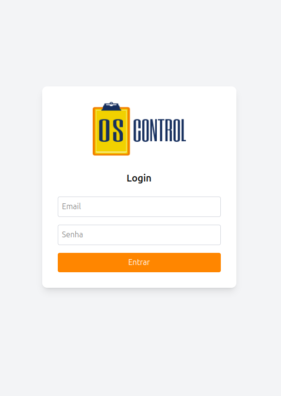
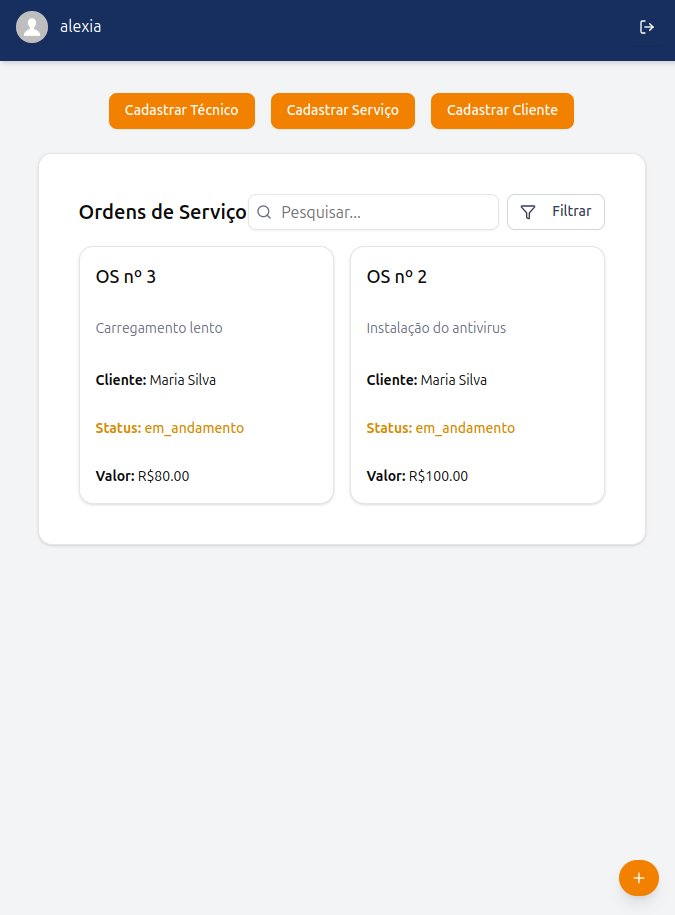

# 🧑‍💻 Gerenciador de Ordens de Serviço - Frontend

Este repositório contém o frontend de um sistema de gestão administrativa desenvolvido com **React 19**, **TypeScript** e **Vite**, utilizando componentes acessíveis da **Radix UI**, estilização com **TailwindCSS**, e integração com a API via **Axios**.

<p align="center">
  
  
</p>

---

## 🚀 Funcionalidades

- Login com token JWT
- Cadastro e listagem de:
  - Técnicos
  - Clientes
  - Serviços
- Modais reutilizáveis para criação de registros
- Atualização dinâmica das listas após criação
- Relatórios básicos com contadores
- Controle de permissões de acordo com o tipo de usuário

---

## 🛠️ Tecnologias e bibliotecas utilizadas

- [React 19](https://react.dev/)
- [TypeScript](https://www.typescriptlang.org/)
- [Vite](https://vitejs.dev/)
- [TailwindCSS 4](https://tailwindcss.com/)
- [Radix UI](https://www.radix-ui.com/) (Avatar, Dialog, Label, Popover, Select)
- [Axios](https://axios-http.com/)
- [React Router DOM 7](https://reactrouter.com/en/main)
- [Lucide React](https://lucide.dev/) (ícones)
- [date-fns](https://date-fns.org/) (manipulação de datas)
- [clsx](https://github.com/lukeed/clsx) e [tailwind-merge](https://github.com/dcastil/tailwind-merge) para composição de classes utilitárias

---

## 🏁 Como rodar o projeto

### Pré-requisitos

- Node.js 18+ e npm
- Backend rodando em `http://localhost:3000`

### Instalação

```bash
git clone https://github.com/not-a-ai/OScontrol_fe
cd seu-projeto
npm install
```

### Execução em desenvolvimento

```bash
npm run dev
```

Acesse: http://localhost:5173

## 🔐 Autenticação

- O sistema utiliza JWT.
- Após o login, o token é salvo no localStorage.
- Ele é usado no Authorization dos headers das requisições.

```ts
const token = localStorage.getItem('token');
axios.get('/rota', {
  headers: {
    Authorization: `Bearer ${token}`,
  },
});
```

## 👥 Tipos de Usuários e Permissões

O sistema possui controle básico de acesso com os seguintes perfis:

| Tipo de Usuário   | Permissões                                                |
| ----------------- | --------------------------------------------------------- |
| **Administrador** | - Cadastrar/editar/excluir técnicos, clientes e serviços. |
|                   | - Visualizar todas as ordens de serviço.                  |
|                   | - Acessar relatórios (futuramente).                       |
| **Técnico**       | - Visualizar ordens de serviço atribuídas a si.           |
|                   | - Atualizar o status das ordens.                          |

🔐 As permissões são gerenciadas no backend com base no campo `tipo` do usuário autenticado

## 🧹 Qualidade de código

- Padrão ESLint + Prettier configurado
- Tipagem com TypeScript
- Organização por componentes reutilizáveis e coesos

## 📝 Possíveis melhorias

- Filtros e ordenação nas tabelas

- Paginação

- Tela de perfil do usuário

- Testes

- Dark mode

## 👩‍💻 Desenvolvedora

Este projeto foi desenvolvido por Aléxia Costa como parte de uma atividade acadêmica, com foco em desenvolvimento web fullstack.

Atividades realizadas no frontend:

- Criação de interface com React e Tailwind CSS
- Uso do Vite como bundler
- Consumo de API com Axios
- Implementação de modal reutilizável
- Controle de estados com hooks (`useState`, `useEffect`)
- Estruturação de rotas com React Router DOM
- Separação por componentes reutilizáveis

Atividades previstas no planejamento:

- ✅ Cadastro de clientes, técnicos e serviços
- ✅ Visualização e manipulação de dados via modal
- ✅ Validação básica de formulários
- ❌ Relatório de ordens de serviço (não implementado)
- ✅ Controle de tipos de usuário (cliente, técnico, admin)

---

📧 Contato: [alexia.cassia09@gmail.com]  
🔗 LinkedIn: [https://www.linkedin.com/in/alexiagcosta/](https://www.linkedin.com/in/alexiagcosta/)
